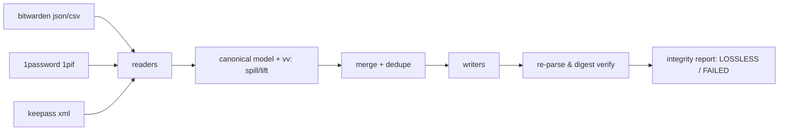

# vaultvert

[English](README.md) | [中文](README.zh.md) | [日本語](README.ja.md)

[](LICENSE) [](Cargo.toml)  [](CONTRIBUTING.md)

**パスワードマネージャーのエクスポートを変換・統合するオープンソースツール — Bitwarden・1Password・KeePass 間でフィールドをロスレスにマッピングし、整合性レポートで検証。完全オフライン、依存ゼロの単一バイナリ。**


```bash
git clone https://github.com/JaydenCJ/vaultvert.git && cargo install --path vaultvert
```

## なぜ vaultvert？

ベンダーの「はしご外し」のたびに移行の波が起き、最も機微なファイルが最悪のパイプラインを通ることになります。CSV にエクスポートし、表計算ソフトで列をいじり、インポーターが正しく推測してくれることを祈る——。CSV は TOTP シークレット、カスタムフィールド、タイムスタンプ、秘匿フラグ、アイテム種別を黙って捨てます。各社の内蔵インポーターは一方通行で、それぞれ別の箇所が非可逆なうえ、何を落としたか教えてくれません。ブラウザ型のコンバーターに至っては、全パスワードを Web ページに貼り付けさせます。vaultvert は各マネージャー自身のリッチな形式間を直接変換し、ターゲットに収まらない内容は逆変換可能なカスタムフィールドへ退避したうえで、**自らの出力を再パースし SHA-256 ダイジェストで往復一致を証明**します。LOSSLESS の判定は主張ではなく検証結果です。さらに、衝突したパスワードを決して捨てない重複検出付きで、マネージャー横断のマージもできます。すべてオフラインで、JSON・XML・SHA-256 のコードまで含めた全バイトがこのリポジトリにある単一バイナリです。

|  | vaultvert | 内蔵インポーター | CSV 手作業 | Web コンバーター |
|---|---|---|---|---|
| ロスレスを検証（ダイジェスト再確認） | ○ | × | × | × |
| TOTP / カスタムフィールド / タイムスタンプ保持 | ○ | まちまち・無言で欠落 | ほぼ欠落 | まちまち |
| マネージャー横断のマージ + 重複排除 | ○（衝突は保全） | × | 手作業 | × |
| オフライン動作 | ○ | ○ | ○ | **× — ページに秘密を貼る** |
| どこへ写像されたかのレポート | フィールド別の表 | なし | なし | なし |
| 信頼すべきコード | 1 リポジトリ・依存 0 | 非公開/様々 | 表計算アプリ | 不明なサーバー |

## 特徴

- **約束ではなく検証** — 書き出し後、vaultvert は生成ファイルを再パースし、順序に依存しない SHA-256 ダイジェストをソースと比較。一致した場合のみ `verdict: LOSSLESS` を表示し、不一致なら終了コード 3 で原本の保持を促します。
- **何ひとつ置き去りにしない** — ターゲット形式に native な置き場がないスロット（KeePass へ行くお気に入りフラグ、Bitwarden へ行くセキュアノートのパスワード）は予約済み `vv:` カスタムフィールドとして保存され、どのリーダーも元に戻すため、変換を連鎖させても秘密は失われません。
- **恐れずにマージ** — （種別・タイトル・ユーザー名・URL ホスト）で重複を検出して統合。URL/タグ/フィールドは和集合、新しいパスワードが勝ち、置き換えられた側は消えずに秘匿カスタムフィールドへ残ります。
- **本物の整合性レポート** — フィールド別マッピング表（native スロットか、カスタムフィールドとして保全か）、件数、ダイジェスト、警告を stderr・テキストファイル・スクリプト向け JSON で出力。
- **完全オフライン・依存ゼロ** — バイナリにネットワークコードは存在しません。JSON・XML・CSV・Base64・SHA-256・RFC 3339 の処理はすべて std のみでツリー内実装され、監査対象はこのリポジトリだけです。
- **CSV に正直** — Bitwarden CSV の読み込みには対応しつつ、CSV の書き出しは理由を添えて拒否。非可逆なエクスポートを作らないこと自体が機能です。

## クイックスタート

インストール（Rust 1.75+ が必要）：

```bash
git clone https://github.com/JaydenCJ/vaultvert.git && cargo install --path vaultvert
```

Bitwarden エクスポートを KeePass XML へ変換（レポートは stderr、以下は実際に取得した出力）：

```bash
vaultvert convert examples/bitwarden-vault.json -o vault.xml
```

```text
vaultvert integrity report
==========================
source : examples/bitwarden-vault.json (bitwarden-json), 4 entries
target : vault.xml (keepass-xml), 4 entries
digest : source 6303f3a8…5c9a0bca
         target 6303f3a8…5c9a0bca  [match]

field mapping
  field        -> target                       as         entries
  created      -> Times/CreationTime           native     4
  favorite     -> vv:favorite custom string    custom     1
  fields       -> String[<name>]               native     3
  folder       -> Group nesting                native     4
  kind         -> (login is implicit)          native     2
  kind         -> vv:kind custom string        custom     2
  modified     -> Times/LastModificationTime   native     4
  notes        -> String[Notes]                native     2
  password     -> String[Password]             native     2
  title        -> String[Title]                native     4
  totp         -> String[otp]                  native     1
  url          -> String[URL]                  native     2
  url          -> vv:url.N custom string       custom     1
  username     -> String[UserName]             native     2

verdict: LOSSLESS — all 4 entries round-trip verified
```

3 つの異なるマネージャーのボールトを重複排除しつつ 1 つに統合：

```bash
vaultvert merge examples/bitwarden-vault.json examples/keepass-export.xml examples/onepassword-export.1pif -o merged.json
```

```text
merge: 3 inputs, 8 entries in, 2 duplicates merged (0 password conflicts preserved), 6 entries out
...
verdict: LOSSLESS — all 6 entries round-trip verified
```

`vaultvert inspect <file>` は着手前に、検出した形式・件数・スロット別カバレッジ・ダイジェストを表示します。スクリプト用途には `--json` を。

## 対応フォーマット

| フォーマット | 読 | 書 | 備考 |
|---|---|---|---|
| `bitwarden-json` | ○ | ○ | 非暗号化エクスポート。ログイン、ノート、カード、ID 情報、フォルダー、カスタムフィールド |
| `bitwarden-csv` | ○ | 拒否 | CSV は種別/タイムスタンプ/TOTP をロスレスに運べない — vaultvert は推測せず明言します |
| `1pif` | ○ | ○ | 1Password 交換形式。フォルダー、sections、designations、タグ。ごみ箱のアイテムは警告付きでスキップ |
| `keepass-xml` | ○ | ○ | KeePass 2.x XML エクスポート。入れ子グループ、保護文字列、`otp`、タグ。ごみ箱は警告付きでスキップ |

暗号化コンテナ（`.kdbx`、`.1pux`、パスワード付き Bitwarden JSON）は 0.1.0 では意図的に対象外です。マネージャーから平文の交換形式をエクスポートし、信頼できるマシン上で変換して、中間ファイルを削除してください。各フィールドの写像とダイジェストの計算方法は [docs/field-mapping.md](docs/field-mapping.md) に明記しています。

## 検証

このリポジトリに CI はありません。上記の主張はすべてローカル実行で検証します：`cargo test`（単体 82 + CLI 統合 9 テスト）と `bash scripts/smoke.sh`。後者は実バイナリで全 3 書き込み形式をめぐる変換ツアー、3 マネージャーのマージ、失敗系まで走らせ、`SMOKE OK` を必ず表示します。

## アーキテクチャ



## ロードマップ

- [x] コアエンジン：3 形式のロスレス変換とダイジェスト検証付き整合性レポート、重複排除と衝突保全付きマージ、inspect、依存ゼロの std 実装
- [ ] 暗号化コンテナ対応（`.kdbx` 読み込み、パスワード付き Bitwarden JSON）で平文の中間ファイルをディスクに残さない
- [ ] 1Password `.1pux` アーカイブと Bitwarden の組織/コレクションエクスポート
- [ ] 同じ正準モデルの下でマネージャーを追加（Proton Pass、Dashlane、Enpass）
- [ ] 秘密を除去した共有可能なレポート/フィクスチャを作る `--redact` モード

全リストは [open issues](https://github.com/JaydenCJ/vaultvert/issues) を参照してください。

## コントリビュート

コントリビューション歓迎です — [CONTRIBUTING.md](CONTRIBUTING.md) を読み、[good first issue](https://github.com/JaydenCJ/vaultvert/issues?q=is%3Aissue+is%3Aopen+label%3A%22good+first+issue%22) から始めるか、[discussion](https://github.com/JaydenCJ/vaultvert/discussions) を開いてください。

## ライセンス

[MIT](LICENSE)
