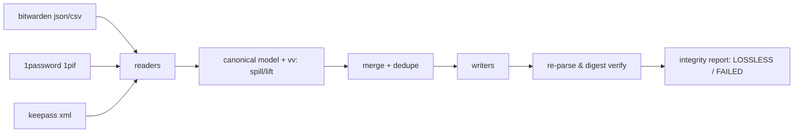

# vaultvert

[English](README.md) | [中文](README.zh.md) | [日本語](README.ja.md)

[](LICENSE) [](Cargo.toml)  [](CONTRIBUTING.md)

**Open-source converter and merger for password-manager exports — lossless field mapping across Bitwarden, 1Password and KeePass, verified by an integrity report, fully offline, in one zero-dependency binary.**


```bash
git clone https://github.com/JaydenCJ/vaultvert.git && cargo install --path vaultvert
```

## Why vaultvert?

Every vendor rug-pull sends a wave of people migrating their most sensitive file through the worst possible pipeline: export to CSV, massage columns in a spreadsheet, hope the importer guesses right. CSV silently drops TOTP secrets, custom fields, timestamps, hidden-field flags and item types; built-in importers are one-way, lossy in different places each, and tell you nothing about what they dropped; browser-based converters ask you to paste every password you own into a web page. vaultvert converts directly between the managers' own rich formats, spills anything the target can't hold natively into custom fields that convert back, then **re-parses its own output and proves the round-trip with SHA-256 digests** — the LOSSLESS verdict is checked, not asserted. It also merges vaults across managers with duplicate detection that never discards a conflicting password. All of it offline, in a single binary whose every byte — including the JSON, XML and SHA-256 code — is in this repository.

|  | vaultvert | built-in importers | CSV juggling | web converters |
|---|---|---|---|---|
| Verified lossless (digest re-check) | yes | no | no | no |
| TOTP / custom fields / timestamps survive | yes | varies, silently | mostly dropped | varies |
| Merge + dedupe across managers | yes (conflicts preserved) | no | manual | no |
| Works offline | yes | yes | yes | **no — you paste secrets into a page** |
| Report of what mapped where | per-field table | none | none | none |
| Code you must trust | 1 repo, 0 dependencies | closed/varies | spreadsheet app | unknown server |

## Features

- **Verified, not promised** — after writing, vaultvert re-parses the produced file and compares order-independent SHA-256 vault digests against the source; only a match prints `verdict: LOSSLESS`, and a mismatch exits 3 and tells you to keep the original.
- **Nothing left behind** — slots the target format can't hold natively (a favorite flag going to KeePass, a password on a secure note going to Bitwarden) are preserved as reserved `vv:` custom fields that every reader lifts back, so chained conversions keep every secret.
- **Merge without fear** — duplicates are detected on (kind, title, username, URL host) and merged: URLs/tags/fields unioned, newest password wins, and the superseded password is kept in a hidden custom field instead of vanishing.
- **A real integrity report** — a per-field mapping table (native slot vs. preserved custom field), entry counts, digests and warnings, on stderr, as a text file, or as JSON for scripting.
- **Fully offline, zero dependencies** — no network code exists in the binary; JSON, XML, CSV, Base64, SHA-256 and RFC 3339 handling are implemented in-tree against std, so the audit surface is exactly this repository.
- **Honest about CSV** — reads Bitwarden CSV, but refuses to write CSV and says why; refusing to produce a lossy export is a feature.

## Quickstart

Install (requires Rust 1.75+):

```bash
git clone https://github.com/JaydenCJ/vaultvert.git && cargo install --path vaultvert
```

Convert a Bitwarden export to KeePass XML (report goes to stderr, real captured output):

```bash
vaultvert convert examples/bitwarden-vault.json -o vault.xml
```

```text
vaultvert integrity report
==========================
source : examples/bitwarden-vault.json (bitwarden-json), 4 entries
target : vault.xml (keepass-xml), 4 entries
digest : source 6303f3a8…5c9a0bca
         target 6303f3a8…5c9a0bca  [match]

field mapping
  field        -> target                       as         entries
  created      -> Times/CreationTime           native     4
  favorite     -> vv:favorite custom string    custom     1
  fields       -> String[<name>]               native     3
  folder       -> Group nesting                native     4
  kind         -> (login is implicit)          native     2
  kind         -> vv:kind custom string        custom     2
  modified     -> Times/LastModificationTime   native     4
  notes        -> String[Notes]                native     2
  password     -> String[Password]             native     2
  title        -> String[Title]                native     4
  totp         -> String[otp]                  native     1
  url          -> String[URL]                  native     2
  url          -> vv:url.N custom string       custom     1
  username     -> String[UserName]             native     2

verdict: LOSSLESS — all 4 entries round-trip verified
```

Merge three vaults from three different managers into one, deduped:

```bash
vaultvert merge examples/bitwarden-vault.json examples/keepass-export.xml examples/onepassword-export.1pif -o merged.json
```

```text
merge: 3 inputs, 8 entries in, 2 duplicates merged (0 password conflicts preserved), 6 entries out
...
verdict: LOSSLESS — all 6 entries round-trip verified
```

`vaultvert inspect <file>` shows the detected format, counts, per-slot coverage and the digest before you commit to anything; add `--json` for scripting.

## Supported formats

| Format | Read | Write | Notes |
|---|---|---|---|
| `bitwarden-json` | yes | yes | unencrypted export; logins, notes, cards, identities, folders, custom fields |
| `bitwarden-csv` | yes | refused | CSV can't carry types/timestamps/TOTP losslessly — vaultvert says so instead of guessing |
| `1pif` | yes | yes | 1Password interchange format: folders, sections, designations, tags; trashed items skipped with a warning |
| `keepass-xml` | yes | yes | KeePass 2.x XML export: nested groups, protected strings, `otp`, tags; Recycle Bin skipped with a warning |

Encrypted containers (`.kdbx`, `.1pux`, password-protected Bitwarden JSON) are deliberately out of scope for 0.1.0: export the plaintext interchange format from your manager, convert on a machine you trust, then delete the intermediates. How every field maps, and how the digest is computed, is specified in [docs/field-mapping.md](docs/field-mapping.md).

## Verification

This repository ships no CI; every claim above is verified by local runs: `cargo test` (82 unit + 9 CLI integration tests) and `bash scripts/smoke.sh`, which drives the real binary through a conversion tour across all three writable formats, a three-manager merge and the failure modes, and must print `SMOKE OK`.

## Architecture



## Roadmap

- [x] Core engine: three-format lossless conversion with digest-verified integrity report, merge with dedupe and conflict preservation, inspect, zero-dependency std-only implementation
- [ ] Encrypted container support (`.kdbx` read, password-protected Bitwarden JSON) so plaintext intermediates never touch disk
- [ ] 1Password `.1pux` archives and Bitwarden organization/collection exports
- [ ] Additional managers behind the same canonical model (Proton Pass, Dashlane, Enpass)
- [ ] `--redact` mode producing a shareable report/fixture with secrets stripped

See the [open issues](https://github.com/JaydenCJ/vaultvert/issues) for the full list.

## Contributing

Contributions are welcome — see [CONTRIBUTING.md](CONTRIBUTING.md), start with a [good first issue](https://github.com/JaydenCJ/vaultvert/issues?q=is%3Aissue+is%3Aopen+label%3A%22good+first+issue%22) or open a [discussion](https://github.com/JaydenCJ/vaultvert/discussions).

## License

[MIT](LICENSE)
