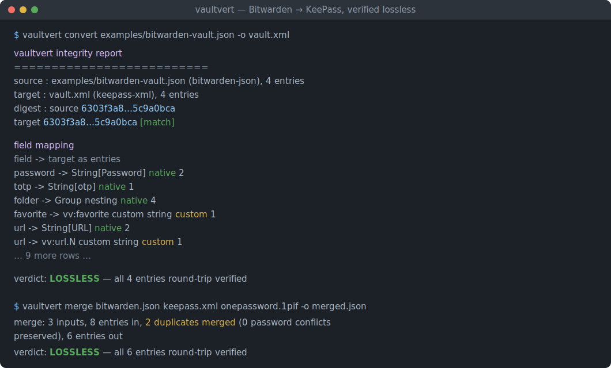
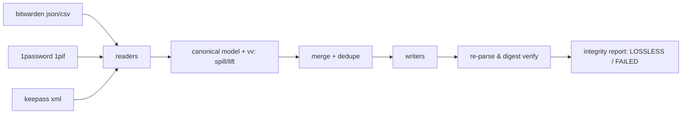

# vaultvert

[English](README.md) | [中文](README.zh.md) | [日本語](README.ja.md)

[](LICENSE) [](Cargo.toml)  [](CONTRIBUTING.md)

**开源的密码管理器导出转换与合并工具 —— 在 Bitwarden、1Password 与 KeePass 之间无损映射字段，以完整性报告验证，全程离线，零依赖单一二进制。**



```bash
git clone https://github.com/JaydenCJ/vaultvert.git && cargo install --path vaultvert
```

## 为什么选 vaultvert？

每次厂商"跑路"都会掀起一波迁移潮，而人们最敏感的文件却要经过最糟糕的管道：导出成 CSV，在电子表格里手工调整列，然后祈祷导入器猜对。CSV 会悄悄丢掉 TOTP 密钥、自定义字段、时间戳、隐藏字段标记和条目类型；各家自带的导入器是单向的，各自在不同的地方有损，且完全不告诉你丢了什么；网页版转换器则让你把所有密码粘贴进一个网页。vaultvert 直接在各管理器自己的富格式之间转换，把目标格式装不下的内容溢写到可以转换回来的自定义字段里，然后**重新解析自己的输出，用 SHA-256 摘要证明往返一致** —— LOSSLESS 结论是校验出来的，不是口头承诺。它还能跨管理器合并保险库，去重时绝不丢弃有冲突的密码。这一切都离线完成，在一个单一二进制里，其每一个字节 —— 包括 JSON、XML 与 SHA-256 代码 —— 都在本仓库中。

|  | vaultvert | 自带导入器 | 手搓 CSV | 网页转换器 |
|---|---|---|---|---|
| 无损可验证（摘要复核） | 是 | 否 | 否 | 否 |
| TOTP / 自定义字段 / 时间戳保留 | 是 | 视情况而定，静默丢失 | 大多丢失 | 视情况而定 |
| 跨管理器合并 + 去重 | 是（冲突保留） | 否 | 手工 | 否 |
| 离线可用 | 是 | 是 | 是 | **否 —— 要把密码粘进网页** |
| 字段映射去向报告 | 逐字段表格 | 无 | 无 | 无 |
| 需要信任的代码 | 1 个仓库，0 依赖 | 闭源/不一 | 电子表格软件 | 未知服务器 |

## 特性

- **验证而非承诺** —— 写出文件后，vaultvert 重新解析产物，与源文件比较顺序无关的 SHA-256 保险库摘要；只有匹配才会打印 `verdict: LOSSLESS`，不匹配则以退出码 3 结束并提醒你保留原始文件。
- **一个字段都不落下** —— 目标格式没有原生位置的槽位（去 KeePass 的收藏标记、去 Bitwarden 的安全笔记密码）会保存为保留的 `vv:` 自定义字段，所有读取器都会将其还原，链式转换也不会丢失任何秘密。
- **放心合并** —— 按（类型、标题、用户名、URL 主机）识别重复项并合并：URL/标签/字段取并集，较新的密码胜出，被替换的密码存入隐藏自定义字段而不是消失。
- **真正的完整性报告** —— 逐字段映射表（原生槽位 vs. 保留为自定义字段）、条目数量、摘要与警告，可输出到 stderr、文本文件或供脚本使用的 JSON。
- **完全离线，零依赖** —— 二进制中不存在任何网络代码；JSON、XML、CSV、Base64、SHA-256 与 RFC 3339 处理全部基于 std 在仓库内实现，审计面就是这一个仓库。
- **对 CSV 诚实** —— 可以读取 Bitwarden CSV，但拒绝写出 CSV 并说明原因；拒绝生成有损导出本身就是一项功能。

## 快速上手

安装（需要 Rust 1.75+）：

```bash
git clone https://github.com/JaydenCJ/vaultvert.git && cargo install --path vaultvert
```

把 Bitwarden 导出转换成 KeePass XML（报告输出到 stderr，以下为真实捕获的输出）：

```bash
vaultvert convert examples/bitwarden-vault.json -o vault.xml
```

```text
vaultvert integrity report
==========================
source : examples/bitwarden-vault.json (bitwarden-json), 4 entries
target : vault.xml (keepass-xml), 4 entries
digest : source 6303f3a8…5c9a0bca
         target 6303f3a8…5c9a0bca  [match]

field mapping
  field        -> target                       as         entries
  created      -> Times/CreationTime           native     4
  favorite     -> vv:favorite custom string    custom     1
  fields       -> String[<name>]               native     3
  folder       -> Group nesting                native     4
  kind         -> (login is implicit)          native     2
  kind         -> vv:kind custom string        custom     2
  modified     -> Times/LastModificationTime   native     4
  notes        -> String[Notes]                native     2
  password     -> String[Password]             native     2
  title        -> String[Title]                native     4
  totp         -> String[otp]                  native     1
  url          -> String[URL]                  native     2
  url          -> vv:url.N custom string       custom     1
  username     -> String[UserName]             native     2

verdict: LOSSLESS — all 4 entries round-trip verified
```

把来自三个不同管理器的保险库合并去重成一个：

```bash
vaultvert merge examples/bitwarden-vault.json examples/keepass-export.xml examples/onepassword-export.1pif -o merged.json
```

```text
merge: 3 inputs, 8 entries in, 2 duplicates merged (0 password conflicts preserved), 6 entries out
...
verdict: LOSSLESS — all 6 entries round-trip verified
```

`vaultvert inspect <file>` 在动手之前先展示识别出的格式、数量、各槽位覆盖率与摘要；加 `--json` 便于脚本处理。

## 支持的格式

| 格式 | 读 | 写 | 说明 |
|---|---|---|---|
| `bitwarden-json` | 是 | 是 | 未加密导出；登录、笔记、银行卡、身份条目、文件夹、自定义字段 |
| `bitwarden-csv` | 是 | 拒绝 | CSV 无法无损承载类型/时间戳/TOTP —— vaultvert 直说，而不是乱猜 |
| `1pif` | 是 | 是 | 1Password 交换格式：文件夹、sections、designations、标签；已删除条目跳过并给出警告 |
| `keepass-xml` | 是 | 是 | KeePass 2.x XML 导出：嵌套群组、受保护字符串、`otp`、标签；回收站跳过并给出警告 |

加密容器（`.kdbx`、`.1pux`、带密码的 Bitwarden JSON）在 0.1.0 中刻意不做：请先从管理器导出明文交换格式，在可信的机器上转换，再删除中间文件。每个字段如何映射、摘要如何计算，详见 [docs/field-mapping.md](docs/field-mapping.md)。

## 验证

本仓库不附带 CI；上述所有断言均由本地运行验证：`cargo test`（82 个单元测试 + 9 个 CLI 集成测试）与 `bash scripts/smoke.sh` —— 后者驱动真实二进制完成跨全部三种可写格式的转换巡游、三管理器合并及各失败路径，并且必须打印 `SMOKE OK`。

## 架构



## 路线图

- [x] 核心引擎：三格式无损转换 + 摘要验证的完整性报告、带去重与冲突保留的合并、inspect、零依赖纯 std 实现
- [ ] 加密容器支持（读取 `.kdbx`、带密码的 Bitwarden JSON），让明文中间文件不落盘
- [ ] 1Password `.1pux` 归档与 Bitwarden 组织/集合导出
- [ ] 在同一规范模型下支持更多管理器（Proton Pass、Dashlane、Enpass）
- [ ] `--redact` 模式，生成脱敏后可分享的报告/用例

完整列表见 [open issues](https://github.com/JaydenCJ/vaultvert/issues)。

## 参与贡献

欢迎贡献 —— 请阅读 [CONTRIBUTING.md](CONTRIBUTING.md)，从 [good first issue](https://github.com/JaydenCJ/vaultvert/issues?q=is%3Aissue+is%3Aopen+label%3A%22good+first+issue%22) 入手，或发起 [discussion](https://github.com/JaydenCJ/vaultvert/discussions)。

## 许可证

[MIT](LICENSE)
